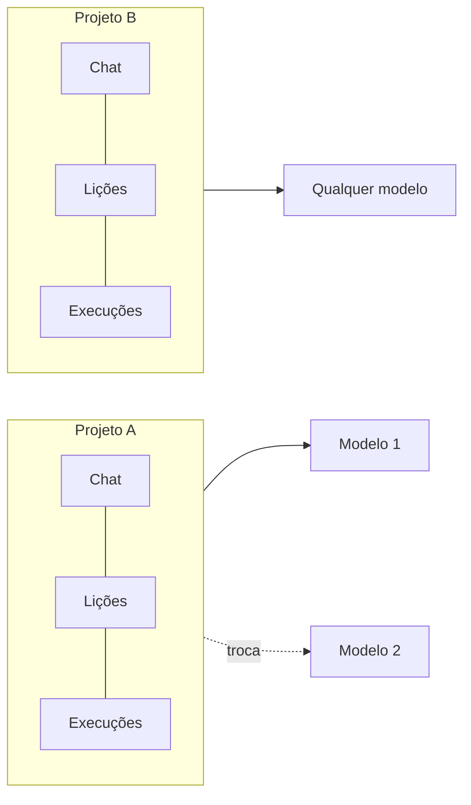

# CBini OrquestrAI

   

🇧🇷 Desenvolvido no Brasil pela CBini Soluções em TI

🇧🇷 **Português** · 🇺🇸 [English](README.md) · 🇪🇸 [Español](README-ES.md)

[Por quê](#por-que-o-orquestrai) · [Como funciona](#como-funciona) · [Arquitetura](docs/arch-br.md) · [Decisões de projeto](docs/design-br.md) · [Segurança](docs/security-br.md) · [Fronteiras de confiança](docs/trust-br.md) · [Evidência de engenharia](docs/evidence-br.md) · [Maturidade](#maturidade-atual) · [Demonstrações](#demonstrações) · [Roadmap](docs/roadmap-br.md) · [Perguntas](docs/faq-br.md) · [Avalie em 10 minutos](docs/eval-br.md) · [Questione a arquitetura](https://github.com/cristhianbini/CBini-OrquestrAI/discussions/2)

**A camada de engenharia em volta da IA: os agentes propõem, as pessoas decidem, o sistema guarda a evidência.**

Um cockpit instalado na sua infraestrutura, onde agentes de IA especializados planejam e constroem software, todo comando que eles propõem espera
aprovação humana, roda isolada e pode ser rastreada, medida e desfeita.

---

## Em um minuto

**O OrquestrAI é onde um time usa IA para construir e alterar software sem abrir mão do controle.** Você descreve o que quer; agentes
de IA planejam e escrevem; toda mudança que mexeria em algo real é mostrada a uma pessoa em linguagem humana e só roda depois que essa
pessoa aprova — isolada, registrada e, onde suportado, reversível. Cada projeto guarda a própria memória, qualquer que seja o modelo de IA.

| | Um chat de IA comum | OrquestrAI |
|---|---|---|
| Quem altera o sistema | Você copia e roda o que a IA escreveu | Nada roda antes de uma pessoa aprovar uma proposta revisável |
| Onde roda | Onde você colar | Num ambiente isolado que só enxerga aquele projeto |
| Desfazer | À mão | Mudanças suportadas são medidas e podem ser revertidas |
| Memória | Presa a uma conversa ou a um modelo | Pertence ao projeto; troque de modelo sem perdê-la |
| Registro e custo | Não ficam | Quem propôs, quem aprovou, o que rodou e quanto custou |

**Comece aqui:** esta página (2 min) → [glossário](docs/glossary-br.md) → [como é construído](docs/arch-br.md) → [o que sai do seu servidor](docs/trust-br.md)
→ [a prova de cada afirmação](docs/evidence-br.md) → [avalie em 10 minutos](docs/eval-br.md).

**Não é para:** rodar código de terceiros não confiável, agentes totalmente autônomos do tipo "dispara e esquece", nem para quem procura um SaaS hospedado hoje.

## Por que o OrquestrAI

A IA já escreve boa parte do código de aplicações reais. Produção precisa de mais do que código: alguém tem de decidir o que pode rodar,
impedir que um projeto mexa em outro, provar o que mudou, desfazer erros e prestar contas do custo.

O OrquestrAI foi feito para essa parte. Ele não tenta deixar o modelo mais inteligente. Ele torna a engenharia com IA **governada,
observável, reversível e economicamente controlável** — na infraestrutura que você escolher.

**Agentes de IA são motores. O OrquestrAI é a camada de engenharia que decide como o trabalho deles vira realidade.** Ele não substitui os
melhores modelos ou agentes de código — organiza, governa, isola, mede e registra o trabalho deles, para que os modelos possam mudar sem que
a governança mude junto.

**O que ele não é:** um novo modelo de linguagem, um substituto dos modelos ou agentes de código que usa, um sandbox para código não
confiável de terceiros, uma plataforma de hospedagem multi-tenant, nem — hoje — um projeto open source.

## Construído da fronteira de execução para dentro

O OrquestrAI não começou pelas funcionalidades. Começou pela pergunta *o que acontece quando o que a IA produz toca um sistema real* — e
a respondeu primeiro: confirmação humana, execução isolada, mudanças medidas e reversíveis, registros à prova de adulteração, contabilidade
de custo, backup cifrado e procedimentos de recuperação, e comportamento fail-closed nos pontos críticos. Uma capacidade só recebe o selo *Disponível* depois que testes automáticos e um operador humano numa instalação real a provaram. As funcionalidades são construídas em cima dessa fundação, não ao lado dela.

## O princípio

> **A IA propõe. As pessoas decidem. O sistema guarda a evidência.**
>
> A IA cria o produto. O OrquestrAI fornece o trilho. Você decide o destino.

## O que o diferencia

| | |
|---|---|
| **Aprovação humana no ponto crítico** | Comandos propostos pela IA nunca rodam sozinhos: cada um vira um bloco de comando revisável, que só roda depois da confirmação de uma pessoa. Conteúdo gerado para o projeto (páginas, código da aplicação) é escrito por geradores validados, não pela execução de comandos escritos pela IA. |
| **Explicar antes de aprovar** | Qualquer mudança proposta pode ser explicada em linguagem simples — intenção, etapas, impacto, risco — sem rodar nada. |
| **Execução isolada** | O comando aprovado roda num ambiente descartável, sem rede e sem privilégios, que enxerga só o próprio projeto. |
| **Operações reversíveis** | O sistema registra o que a mudança pode tocar e mede o que ela de fato mudou; desfazer mostra antes o que será revertido. |
| **Evidência por padrão** | Execuções ficam num registro à prova de adulteração; sessões de terminal são seladas. Dá para ver quem propôs, quem aprovou e o que rodou. |
| **Chat, comando e terminal são coisas diferentes** | Conversa, mudança e inspeção são superfícies separadas, com permissões separadas. O terminal do projeto é somente leitura. |
| **Agentes especializados** | Um planejador monta, a cada tarefa, um time de agentes — estratégia, arquitetura, código, revisão, testes, documentação. |
| **Custo visível** | As chamadas a modelo são registradas por agente e superfície, e atribuídas ao projeto a que pertencem. Preço desconhecido continua desconhecido, não vira zero. |
| **Vários provedores** | Os agentes podem usar provedores diferentes; você usa as suas próprias contas e chaves. |
| **Conhecimento governado** | O sistema propõe lições a partir do próprio trabalho; elas só chegam aos agentes depois que uma pessoa aprova. |
| **Instalação própria** | Uma instalação dedicada por organização, em infraestrutura que ela controla. |

## O projeto é a unidade de contexto

O conhecimento pertence ao projeto, não ao modelo usado naquele momento. Conversas, lições aprovadas, histórico de comandos e custos
ficam guardados por projeto. O operador pode trocar de modelo no meio do trabalho; o modelo seguinte recebe o mesmo contexto do
projeto. Outro projeto parte do próprio contexto e não herda o do primeiro.

## Como funciona

Intenção humana → agentes especializados planejam e constroem → proposta (bloco de comando) → revisão (explicar, vetar com motivo ou
aprovar) → execução isolada → evidência (resultado, preview, custo) → manter ou reverter → lições propostas e aprovadas.
O diagrama está na [versão em inglês](README.md#how-it-works).

## A Fábrica do OrquestrAI

Descreva o projeto em poucas frases; a fábrica planeja, constrói e abre um preview.

- **Sites estáticos — disponível de ponta a ponta:** briefing → plano dos agentes → site gerado → checagens automáticas → preview em origem separada.
- **Aplicações full stack — disponível:** um único caminho totalmente suportado — **React + Vite + TypeScript, Express e SQLite** num só
  processo. A IA escreve a *especificação* da aplicação; o OrquestrAI gera a aplicação a partir de um modelo testado, e a infraestrutura
  sai sempre igual. Cada aplicação roda no próprio ambiente, sem acesso à rede, abre pelo preview em origem separada e é publicada
  sozinha quando a fábrica termina e depois de cada mudança aprovada — se a versão nova falhar, a anterior continua no ar. Mudanças pedidas
  no chat são **aditivas** (campos novos, dados preservados); remover ou renomear campo é recusado. Hoje cada aplicação tem um modelo de
  dados (listar, criar, excluir).
  *Como chegou aqui:* o gerador passou primeiro nos testes funcionais; depois, uma auditoria independente, somente leitura, encontrou casos
  de falha que o caminho feliz não exercita, e ele foi segurado até a correção. Foi promovido depois de um aceite humano de 20 itens numa
  instalação real (outubro de 2026).
- **Outras stacks — planejado,** sobre o mesmo padrão do primeiro caminho full stack.

## Demonstrações

Gravações reais do OrquestrAI em uso e da sua evolução estão no canal oficial da CBini Soluções em TI:
[canal](https://www.youtube.com/@cbinisolucaoemti) · [todos os vídeos](https://www.youtube.com/@cbinisolucaoemti/videos).

## Evidência de engenharia

Uma capacidade não conta porque o código existe. Conta quando o caminho foi provado:
**desenho → prova automática → prova humana num sistema real → revisão independente quando sensível → promoção.**
Passar no caminho feliz não basta: o primeiro gerador full stack passou nos testes funcionais, uma revisão independente achou casos de falha
e ele foi segurado até a correção; só foi promovido depois do aceite humano num sistema real. Processo, estudo de caso e matriz de capacidades: [evidência de engenharia](docs/evidence-br.md).

## Segurança por desenho

Modelo completo — propriedades provadas, o que está em validação, pressupostos, limites e não objetivos: [docs/security-br.md](docs/security-br.md).
Em resumo — propriedades de desenho, não garantias: menor privilégio · execução explícita (nada roda sem confirmação; acesso administrativo separado,
com segundo fator) · isolamento (comandos aprovados e terminais do projeto em containers por projeto, sem rede; previews em origem separada; aplicações full stack rodam sem acesso à rede e só são alcançadas pelo preview) · reversibilidade onde suportado · trilha de auditoria à
prova de adulteração · revisão externa independente antes de promover mudanças de execução, isolamento e recuperação · disciplina de
recuperação (controle de versão, backup cifrado fora do servidor com verificação automática, snapshots).

## Provedores de IA

As rotas validadas usam hoje modelos Anthropic e OpenAI. Groq, Gemini, OpenRouter, Cerebras, Z.ai e qualquer API compatível com OpenAI
podem ser configurados e testados pelo painel. Instalação própria dá controle sobre infraestrutura, provedores e fluxo de dados; quando
um provedor de IA em nuvem é usado, o conteúdo enviado a ele segue os termos desse provedor.

## Maturidade atual

| Capacidade | Estado |
|---|---|
| Cockpit com chat, comandos, terminal e custo por projeto | Disponível |
| Blocos de comando com explicar, aprovar e vetar | Disponível |
| Execução isolada das mudanças aprovadas | Disponível |
| Reverter com prévia do desfazer | Disponível |
| Terminal do projeto somente leitura | Disponível |
| Dois fatores e confirmação reforçada | Disponível |
| Mesh de agentes com planejador | Disponível |
| Telemetria de custo por projeto, agente e chamada | Disponível |
| Lições governadas | Disponível |
| Fábrica: sites estáticos | Disponível |
| Backup cifrado fora do servidor com verificação | Disponível |
| Fábrica: aplicações full stack (React · Express · SQLite) | Disponível |
| Outros provedores de IA | Configurável |
| Recuperação completa num servidor novo | Planejado |
| Instalador guiado (um comando + assistente) | Planejado |
| Outras stacks e bancos | Planejado |

**Disponível** — provado por testes automáticos e por um operador humano numa instalação real. **Em validação** — construído e testado,
passando por prova e revisão independente antes da promoção; não liberado para operadores. **Configurável** — pode ser configurado e
testado, sem o nível de validação dos caminhos principais. **Planejado** — ainda não é funcionalidade.

## Para quem

Fábricas de software e agências · times internos de engenharia · times nativos em IA · organizações que precisam que o trabalho com IA
rode sob a própria governança.

## Por que importa para uma empresa

Aprovação humana exatamente onde a mudança fica real · saber quem propôs, quem aprovou e o que rodou em cada comando executado · desfazer mudanças suportadas em vez
de consertar à mão · ver o custo da IA por projeto e por agente, e distribuir o trabalho entre provedores · rodar na infraestrutura
escolhida, com as próprias contas · transformar um conjunto de ferramentas de IA num time com processo.

## Feedback

Preferimos saber onde o OrquestrAI está errado a colecionar estrelas.

- **Discorda de alguma premissa da arquitetura?** [Questione a arquitetura](https://github.com/cristhianbini/CBini-OrquestrAI/discussions/2).
- **Falta um caso de uso?** Abra uma ideia ou sugestão.
- **Algo confuso?** Envie feedback de UX ou um problema de documentação.
- **Achou uma falha de segurança?** Relate em privado — veja o [SECURITY.md](SECURITY.md).

Como participar: [CONTRIBUTING](CONTRIBUTING-BR.md) · [avalie a ideia em 10 minutos](docs/eval-br.md).

## Sobre

**CBini OrquestrAI** — concebido e dirigido por Cristhian Bini, CBini Soluções em TI. Construído com a assistência de vários sistemas
de IA, sob decisão humana e revisão independente — o mesmo processo que o produto aplica aos projetos de quem o usa.

Este repositório é a documentação pública e a vitrine do CBini OrquestrAI. O código-fonte do produto não está publicado aqui. Este
projeto não é distribuído como software open source. O modelo de licenciamento está em definição. Todos os direitos reservados.

Mais: [visão técnica](docs/arch-br.md) · [fronteiras de confiança](docs/trust-br.md) · [evidência de engenharia](docs/evidence-br.md) · [modelo de segurança](docs/security-br.md) · [roadmap público](docs/roadmap-br.md) · [perguntas frequentes](docs/faq-br.md)
