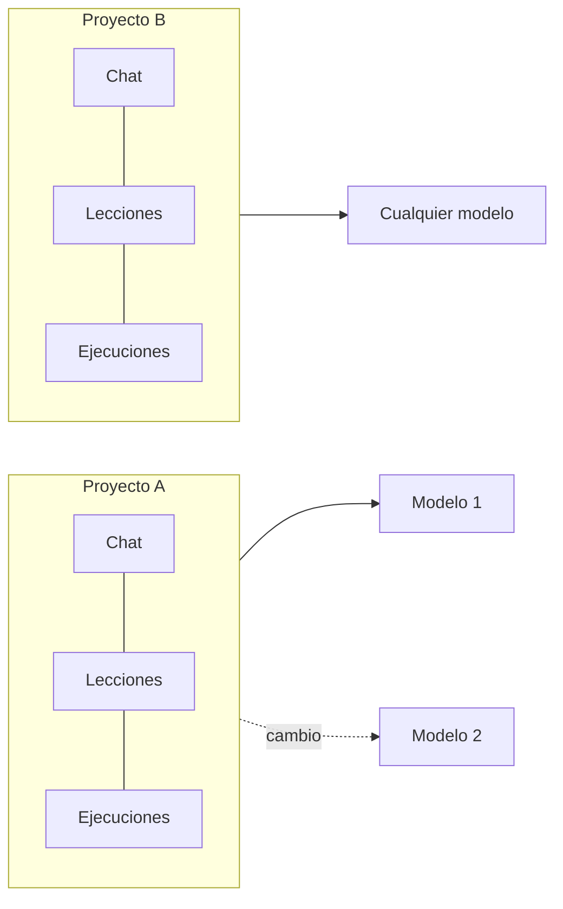
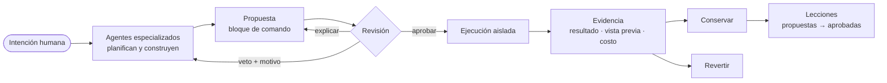
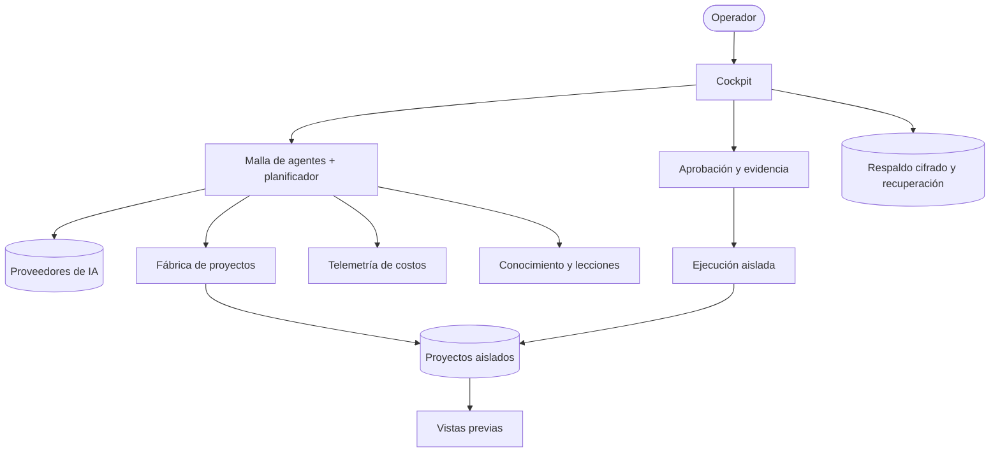
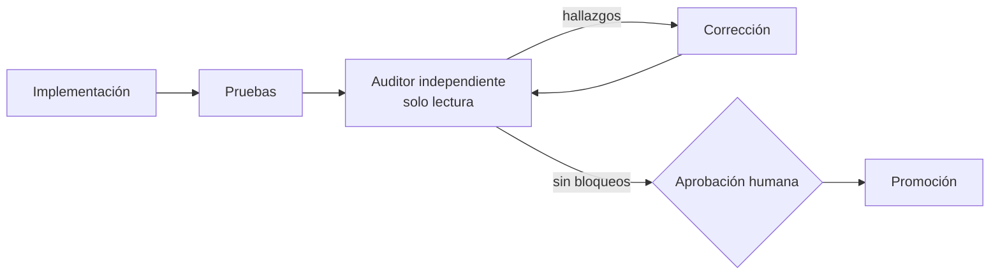

# CBini OrquestrAI

   

🇧🇷 Desarrollado en Brasil por CBini Soluções em TI

🇪🇸 **Español** · 🇧🇷 [Português](README-BR.md) · 🇺🇸 [English](README.md)

[Por qué](#por-qué-orquestrai) · [Cómo funciona](#cómo-funciona) · [Madurez](#madurez-actual) · Documentación técnica (en inglés): [Arquitectura](docs/arch.md) · [Seguridad](docs/security.md) · [Hoja de ruta](docs/roadmap.md) · [Preguntas](docs/faq.md) · [Evaluar en 10 minutos](docs/eval.md)

**La capa de ingeniería alrededor de la IA: los agentes proponen, las personas deciden, el sistema conserva la evidencia.**

Un cockpit autoalojado donde agentes de IA especializados planifican y construyen software; cada comando que proponen espera la
aprobación de una persona, se ejecuta de forma aislada y puede rastrearse, medirse y deshacerse.

---

## Por qué OrquestrAI

La IA ya puede escribir buena parte del código de aplicaciones reales. Producción necesita más que código: alguien tiene que decidir qué
puede ejecutarse, impedir que un proyecto toque a otro, demostrar qué cambió, deshacer errores y saber cuánto costó.

OrquestrAI está hecho para esa parte. No intenta hacer más inteligente al modelo. Hace que la ingeniería con IA sea **gobernada,
observable, reversible y económicamente controlable**, en la infraestructura que usted elija.

**Los agentes de IA son motores. OrquestrAI es la capa de ingeniería que decide cómo su trabajo se vuelve real.** No reemplaza a los
mejores modelos ni a los agentes de programación: organiza, gobierna, aísla, mide y registra su trabajo, de modo que los modelos puedan
cambiar sin que cambie la gobernanza.

**Lo que no es:** un nuevo modelo de lenguaje, un sustituto de los modelos o agentes que utiliza, un sandbox para código de terceros no
confiable, una plataforma de hosting multiinquilino ni, hoy, un proyecto de código abierto.

## Construido desde la frontera de ejecución hacia adentro

OrquestrAI no empezó por las funcionalidades. Empezó por la pregunta *qué pasa cuando la salida de una IA toca un sistema real* y la
respondió primero: confirmación humana, ejecución aislada, cambios medidos y reversibles, registros a prueba de manipulación, control de
costos, copias de seguridad cifradas y procedimientos de recuperación, y comportamiento a prueba de fallos (*fail-closed*) en los puntos
críticos. Una capacidad se marca como *Disponible* solo después de que pruebas automáticas y un operador humano en una instalación real la
hayan demostrado.

## El principio

> **La IA propone. Las personas deciden. El sistema conserva la evidencia.**

## Qué lo diferencia

| | |
|---|---|
| **Aprobación humana en el punto crítico** | Los comandos propuestos por la IA nunca se ejecutan solos: cada uno se convierte en un bloque de comando revisable que solo corre después de que una persona lo confirma. |
| **Explicar antes de aprobar** | Cualquier cambio propuesto puede explicarse en lenguaje claro (intención, pasos, impacto, riesgo) sin ejecutar nada. El resumen humano aparece antes del código, que sigue disponible completo. |
| **Ejecución aislada** | Los comandos aprobados se ejecutan en un entorno desechable, sin red y sin privilegios, que solo ve su propio proyecto. |
| **Operaciones reversibles** | El sistema registra lo que un cambio puede tocar y mide lo que realmente cambió; deshacer muestra primero qué se revertirá. |
| **Evidencia por defecto** | Las ejecuciones quedan en una cadena a prueba de manipulación: quién propuso, quién aprobó y qué se ejecutó. |
| **Agentes especializados** | Un planificador arma un equipo de agentes por tarea: estrategia, arquitectura, código, revisión, pruebas y documentación. |
| **Costos visibles** | Cada llamada a un modelo se registra por agente y se atribuye a su proyecto. Un precio desconocido sigue siendo desconocido, nunca cero. |
| **Varios proveedores** | Los agentes pueden usar distintos proveedores de modelos, con sus propias cuentas y claves. |
| **Conocimiento gobernado** | El sistema propone lecciones a partir de su propio trabajo; llegan a los agentes solo después de que una persona las aprueba. |
| **Autoalojado** | Una instalación dedicada por organización, en infraestructura que ella controla. |

## El proyecto es la unidad de contexto

El conocimiento pertenece al proyecto, no al modelo que se usa en ese momento. Conversaciones, lecciones aprobadas, historial de comandos
y costos se guardan por proyecto. El operador puede cambiar de modelo en medio del trabajo; el siguiente modelo recibe el mismo contexto
del proyecto. Otro proyecto parte de su propio contexto y no hereda el del primero.

## Cómo funciona

## La Fábrica de OrquestrAI

Describa un proyecto en pocas frases; la Fábrica lo planifica, lo construye y abre una vista previa. El operador sigue cada etapa:
Planificar → Construir → Revisar → Generar la aplicación → Publicar.

- **Sitios estáticos — disponible de punta a punta:** brief → plan de los agentes → sitio generado → verificaciones automáticas → vista
  previa en un origen separado.
- **Aplicaciones full stack — disponible:** un único camino totalmente soportado, **React + Vite + TypeScript, Express y SQLite** en un
  solo proceso. La IA escribe la *especificación* de la aplicación; OrquestrAI genera la aplicación a partir de una plantilla probada, así
  que la infraestructura es siempre la misma. Cada aplicación se ejecuta en su propio entorno, sin acceso a la red, se abre por la vista
  previa en un origen separado y se publica automáticamente al terminar la Fábrica y después de cada cambio aprobado; si una versión nueva
  falla, la anterior sigue en línea. Los cambios pedidos en el chat son **aditivos** (campos nuevos, datos preservados); eliminar o
  renombrar un campo se rechaza. Hoy cada aplicación tiene un modelo de datos (listar, crear, eliminar).
  *Cómo llegó aquí:* el generador pasó primero sus pruebas funcionales; luego una auditoría independiente, de solo lectura, encontró casos
  de falla que el camino feliz no ejercita, y se retuvo hasta corregirlos. Se promovió tras una aceptación humana de 20 puntos en una
  instalación real (octubre de 2026).
- **Más stacks — planificado,** sobre el mismo patrón del primer camino full stack.

## Arquitectura

Vista técnica completa (en inglés): [docs/arch.md](docs/arch.md).

## Evidencia de ingeniería

Una capacidad no cuenta porque el código existe. Cuenta cuando el camino fue demostrado:
**diseño → prueba automática → prueba humana en un sistema real → revisión independiente cuando es sensible → promoción.**

Una auditoría reprobada detiene la promoción aunque todas las pruebas funcionales estén en verde. Ya ocurrió varias veces: el auditor
encontró casos fuera del camino feliz, la promoción se detuvo, hubo corrección y una nueva auditoría antes de seguir.

## Seguridad por diseño

Propiedades de diseño, no garantías absolutas:

- **Mínimo privilegio:** ejecución sin red, sin privilegios y sin acceso fuera del proyecto.
- **Ejecución explícita:** ningún camino ejecuta salida de IA sin confirmación humana; el acceso administrativo es separado y exige segundo factor.
- **Aislamiento:** comandos aprobados y terminales de proyecto en contenedores por proyecto, sin red; vistas previas en un origen separado; las aplicaciones full stack se ejecutan sin acceso a la red.
- **Reversibilidad:** donde está soportado, los cambios se deshacen con vista previa de lo que se revertirá.
- **Rastro de auditoría:** registros de ejecución a prueba de manipulación.
- **Revisión independiente:** los cambios de ejecución, aislamiento y recuperación pasan por una auditoría externa de solo lectura antes de promoverse.
- **Recuperación en capas:** control de versiones (la receta del producto), respaldo cifrado diario fuera del servidor con verificación automática (la caja fuerte fuera de casa) e instantáneas del servidor (la foto de la máquina entera).

Modelo completo (en inglés): [docs/security.md](docs/security.md).

## Proveedores de IA

Los agentes se asignan por función. Las rutas validadas usan hoy modelos de Anthropic y OpenAI; otros proveedores (Groq, Gemini,
OpenRouter, Cerebras, Z.ai y APIs compatibles con OpenAI) pueden configurarse y probarse desde el panel.

Autoalojar le da control sobre la infraestructura, los proveedores y el flujo de datos. Cuando se usa un proveedor de IA en la nube, el
contenido enviado a él queda sujeto a los términos de ese proveedor.

## Madurez actual

| Capacidad | Estado |
|---|---|
| Cockpit con chat, comandos, terminal y costos por proyecto | Disponible |
| Bloques de comando con explicar, aprobar y vetar | Disponible |
| Ejecución aislada de cambios aprobados | Disponible |
| Revertir con vista previa de lo que se deshará | Disponible |
| Terminal de proyecto de solo lectura | Disponible |
| Autenticación de dos factores y confirmación reforzada para acciones sensibles | Disponible |
| Malla de agentes con planificador | Disponible |
| Telemetría de costos por proyecto, agente y llamada | Disponible |
| Lecciones gobernadas | Disponible |
| Fábrica: sitios estáticos | Disponible |
| Respaldo cifrado fuera del servidor con verificación | Disponible |
| Fábrica: aplicaciones full stack (React · Express · SQLite) | Disponible |
| Proveedores de IA adicionales | Configurable |
| Recuperación completa en un servidor nuevo | Planificado |
| Instalador guiado (un comando + asistente) | Planificado |
| Stacks y bases de datos adicionales | Planificado |

**Disponible:** demostrado por pruebas automáticas y por un operador humano en una instalación real. **Configurable:** puede configurarse
y probarse, sin el nivel de validación de los caminos principales. **Planificado:** todavía no es una funcionalidad.

El producto está en etapa de **piloto y validación**: el núcleo pasó por las puertas de aceptación humana y sigue evolucionando.

## Para quién

Fábricas de software y agencias · equipos internos de ingeniería · equipos nativos en IA · organizaciones que necesitan que el trabajo con
IA se ejecute bajo su propia gobernanza.

## Participar

- ¿No está de acuerdo con una decisión de arquitectura? [Cuestione la arquitectura](https://github.com/cristhianbini/CBini-OrquestrAI/discussions/2).
- ¿Encontró un problema de seguridad? Repórtelo en privado: [SECURITY.md](SECURITY.md).
- Cómo contribuir: [CONTRIBUTING](CONTRIBUTING.md) · [evaluar la idea en 10 minutos](docs/eval.md).

## Acerca de

**CBini OrquestrAI**: concebido y dirigido por Cristhian Bini, CBini Soluções em TI.

Este repositorio es la documentación pública y la vitrina de CBini OrquestrAI. El código fuente del producto no se publica aquí. Este
proyecto no se distribuye como software de código abierto. El modelo de licenciamiento está actualmente en definición. Todos los derechos
reservados.
