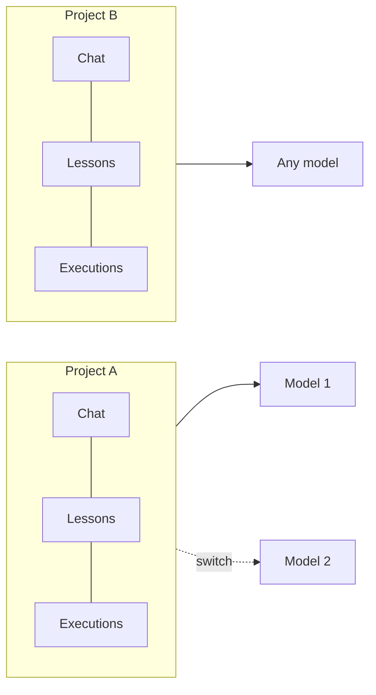
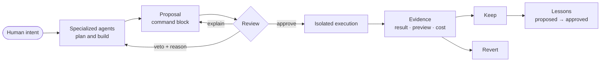
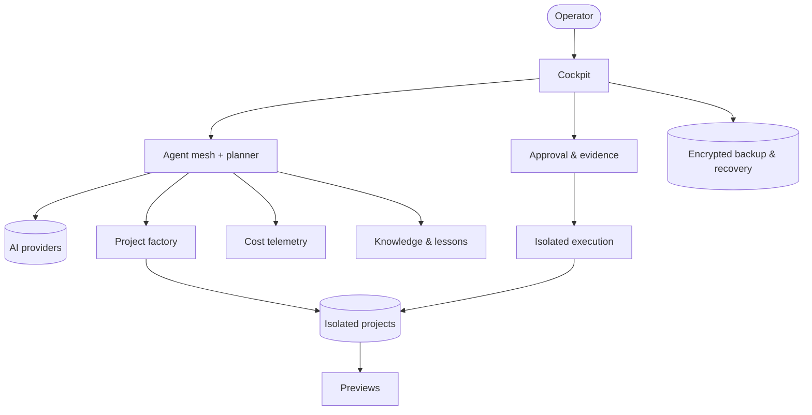

# CBini OrquestrAI

   

🇧🇷 Built in Brazil by CBini Soluções em TI

🇺🇸 **English** · 🇧🇷 [Português](README-BR.md) · 🇪🇸 [Español](README-ES.md)

[Why](#why-orquestrai) · [How it works](#how-it-works) · [Architecture](docs/arch.md) · [Design decisions](docs/design.md) · [Security](docs/security.md) · [Trust boundaries](docs/trust.md) · [Engineering evidence](docs/evidence.md) · [Maturity](#current-maturity) · [Demos](#demos) · [Roadmap](docs/roadmap.md) · [FAQ](docs/faq.md) · [Evaluate in 10 minutes](docs/eval.md) · [Challenge the architecture](https://github.com/cristhianbini/CBini-OrquestrAI/discussions/2)

**The engineering layer around AI: agents propose, people decide, the system keeps the evidence.**

A self-hosted cockpit where specialized AI agents plan and build software, every command they propose waits for human approval,
runs in isolation, and can be traced, measured and undone.

---

## In one minute

**OrquestrAI is where a team uses AI to build and change software without giving up control.** You describe what you want; AI agents
plan and write it; every change that would touch something real is shown to a person in plain language and runs only after that person
approves it — isolated, recorded, and reversible where supported. Each project keeps its own memory, whatever AI model you use.

| | A typical AI chat | OrquestrAI |
|---|---|---|
| Who changes the system | You copy and run what the AI wrote | Nothing runs until a person approves a reviewable proposal |
| Where it runs | Wherever you paste it | In an isolated environment that only sees that project |
| Undo | By hand | Supported changes are measured and can be reverted |
| Memory | Tied to a conversation or a model | Belongs to the project; switch models without losing it |
| Record and cost | Not kept | Who proposed, who approved, what ran and what it cost |

**Start here:** this page (2 min) → [glossary](docs/glossary.md) → [how it is built](docs/arch.md) → [what leaves your server](docs/trust.md)
→ [proof behind each claim](docs/evidence.md) → [evaluate it in 10 minutes](docs/eval.md).

**Not for:** running untrusted third-party code, fully autonomous "fire and forget" agents, or teams looking for a hosted SaaS today.

## Why OrquestrAI

AI can already write a large share of the code for real applications. Production needs more than code: someone must decide what is
allowed to run, keep one project from touching another, prove what changed, undo mistakes, and account for what it cost.

OrquestrAI is built for that part. It does not try to make the model smarter. It makes AI engineering **governed, observable,
reversible and economically controllable** — on infrastructure you choose.

**AI agents are engines. OrquestrAI is the engineering layer that decides how their work becomes real.** It does not replace the best
models or coding agents — it organizes, governs, isolates, measures and records their work, so models can change without the governance
changing with them.

**What it is not:** a new language model, a replacement for the models or coding agents it uses, a sandbox for untrusted third-party
code, a multi-tenant hosting platform, or — today — an open-source project.

## Built from the execution boundary inward

OrquestrAI did not start with features. It started with the question *what happens when AI output touches a real system* — and answered
it first: human confirmation, isolated execution, measured and reversible changes, tamper-evident records, cost accounting, encrypted
backups and recovery procedures, and fail-closed behavior at critical points. A capability is labeled *Available* only after automated tests and a human operator on a live deployment have proven it. Features are built on top of that foundation, not beside it.

## The principle

> **AI proposes. People decide. The system keeps the evidence.**
>
> The AI builds the product. OrquestrAI lays the track. You decide where it goes.

## What makes it different

| | |
|---|---|
| **Human approval at the critical point** | AI-proposed commands never run on their own: each becomes a reviewable command block that runs only after a person confirms it. Generated project content (pages, application code) is written by validated generators, not by running AI-written commands. |
| **Explain before you approve** | Any proposed change can be explained in plain language — intent, steps, impact, risk — without running anything. |
| **Isolated execution** | Approved commands run in a disposable, network-less, unprivileged environment that sees only their own project. |
| **Reversible operations** | The system records what a change may touch and measures what it actually changed; undo shows what will be reverted first. |
| **Evidence by default** | Executions are recorded in a tamper-evident chain; terminal sessions are sealed. You can see who proposed, who approved and what ran. |
| **Chat, command and terminal are different things** | Conversation, change and inspection are separate surfaces with separate permissions. The project terminal is read-only. |
| **Specialized agents** | A planner assembles a team of specialized agents per task — strategy, architecture, code, review, testing, documentation. |
| **Cost visibility** | Model calls are recorded by agent and surface, and attributed to the project they belong to. Unknown prices stay unknown instead of becoming zero. |
| **Multi-provider** | Agents can be routed to different model providers; you bring your own accounts and keys. |
| **Governed knowledge** | The system proposes lessons from its own work; they reach the agents only after a person approves them. |
| **Self-hosted** | One dedicated deployment per organization, on infrastructure it controls. |

## The project is the unit of context

Knowledge belongs to the project, not to the model in use at the moment. Conversations, approved lessons, command history and costs
are stored per project. The operator can switch models in the middle of the work; the next model receives the same project context.
A different project starts from its own context and does not inherit the first one.

## How it works

## The OrquestrAI Factory

Describe a project in a few sentences; the factory plans it, builds it and opens a preview.

- **Static websites — available end to end:** brief → agent plan → generated site → automated checks → preview on a separate origin.
- **Full-stack applications — available:** a single, fully supported path — **React + Vite + TypeScript, Express and SQLite** in one
  process. The AI writes the application *specification*; OrquestrAI generates the application from a tested template, so the
  infrastructure is the same every time. Each application runs in its own runtime with no network access, opens through the preview on a
  separate origin, and is published automatically when the factory finishes and after each approved change — if a new version fails, the
  previous one stays online. Changes requested in chat are **additive** (new fields, data preserved); removing or renaming a field is refused.
  Today an application has one data model (list, create, delete).
  *How it got here:* the generator first passed its functional tests, then an independent read-only audit found failure cases the happy
  path does not exercise; it was held back until they were fixed. It was promoted after a 20-item human acceptance on a live deployment
  (October 2026).
- **More stacks — planned,** built on the same pattern as the first full-stack path.

## Demos

Real recordings of OrquestrAI in use and of its evolution are published on the official CBini Soluções em TI channel
(in Portuguese): [channel](https://www.youtube.com/@cbinisolucaoemti) · [all videos](https://www.youtube.com/@cbinisolucaoemti/videos).

## Architecture

High-level view below; boundaries and the life of a change are in the [technical overview](docs/arch.md).

## Engineering evidence

A capability is not counted because the code exists. It is counted when the path has been proven:
**design → automated proof → human proof on a live system → independent review when sensitive → promotion.**
Passing the happy path is not enough: the first full-stack generator passed its functional tests, an independent review found failure cases,
and it was held back until they were fixed; it was promoted only after human acceptance on a live system. Process, case study and capability matrix: [engineering evidence](docs/evidence.md).

## Security by design

Full model — proven properties, work in validation, assumptions, limits and non-goals: [docs/security.md](docs/security.md).
In short — design properties, not guarantees:

- **Least privilege** — execution without network, privileges or access outside the project.
- **Explicit execution** — no path runs AI output without human confirmation; administrative access is separate and requires a second factor.
- **Isolation** — approved commands and project terminals run in per-project, network-less containers; previews are served from a separate origin. Full-stack applications run without network access and are reached only through the preview.
- **Reversibility** — where supported, changes are undone with a preview of the undo.
- **Audit trail** — tamper-evident execution records; sealed terminal sessions.
- **Independent review** — changes to execution, isolation and recovery pass a read-only external audit before promotion.
- **Recovery discipline** — version control, encrypted off-site backups with automatic verification, and server snapshots.

## AI providers

Agents are routed per role. The validated routes use Anthropic and OpenAI models today. Other providers — Groq, Gemini, OpenRouter,
Cerebras, Z.ai and any OpenAI-compatible API — can be configured and tested from the control panel.

Self-hosting gives you control over infrastructure, providers and data flow. When a cloud AI provider is used, the content sent to it
is subject to that provider's terms.

## Current maturity

| Capability | Status |
|---|---|
| Cockpit with project-scoped chat, commands, terminal and cost | Available |
| Command blocks with explain, approve and veto | Available |
| Isolated execution of approved changes | Available |
| Revert with preview of the undo | Available |
| Read-only project terminal | Available |
| Two-factor authentication and step-up for sensitive actions | Available |
| Agent mesh with planner | Available |
| Cost telemetry per project, agent and call | Available |
| Governed lessons | Available |
| Factory: static websites | Available |
| Encrypted off-site backup with verification | Available |
| Factory: full-stack applications (React · Express · SQLite) | Available |
| Additional AI providers | Configurable |
| Full recovery on a clean server | Planned |
| Guided installer (one command + setup wizard) | Planned |
| Additional stacks and databases | Planned |

**Available** — proven by automated tests and by a human operator on a live deployment. **In validation** — built and tested, going
through proof and independent review before promotion; not enabled for operators. **Configurable** — can be set up and tested, without the
validation level of the main paths. **Planned** — not a feature yet.

## Roadmap

- Full-stack applications beyond the first path: richer data models on the same additive-change contract.
- Reproducible self-hosted deployment and recovery validated on a clean server.
- Guided installer and setup wizard.
- More validated stacks and databases on the same foundation.
- Governance features for larger teams.

## Built for

Software factories and development agencies · internal engineering teams · AI-native teams · organizations that need AI work to run under
their own governance.

## Why it matters for a company

- Put human approval exactly where changes become real, and nowhere else.
- Know who proposed, who approved and what ran — for every executed command.
- Undo supported changes instead of repairing them by hand.
- See what AI costs, per project and per agent, and route work across providers instead of depending on one.
- Run on the infrastructure you choose, with your own provider accounts.
- Turn a set of AI tools into an organized team with a process.

## Feedback

We would rather hear where OrquestrAI is wrong than collect stars.

- **Disagree with an architectural assumption?** [Challenge the architecture](https://github.com/cristhianbini/CBini-OrquestrAI/discussions/2).
- **Missing a use case?** Open an idea or a feature suggestion.
- **Something confusing?** Send UX feedback or a documentation issue.
- **Found a security issue?** Report it privately — see [SECURITY.md](SECURITY.md).

How to take part: [CONTRIBUTING](CONTRIBUTING.md) · [evaluate the idea in 10 minutes](docs/eval.md).

## About

**CBini OrquestrAI** — conceived and directed by Cristhian Bini, CBini Soluções em TI. Built with the assistance of multiple AI systems,
under human decision and independent review — the same process the product applies to its users' projects.

This repository is the public documentation and showcase for CBini OrquestrAI. The product source code is not published here and
this project is not distributed as open-source software. Its licensing model is currently being defined. All rights reserved.

More: [technical overview](docs/arch.md) · [trust boundaries](docs/trust.md) · [engineering evidence](docs/evidence.md) · [security model](docs/security.md) · [public roadmap](docs/roadmap.md) · [FAQ](docs/faq.md)
