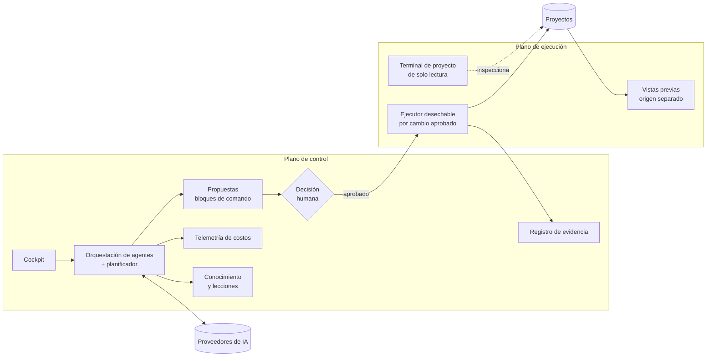

# Visión técnica — CBini OrquestrAI

🇪🇸 **Español** · 🇧🇷 [Português](arch-br.md) · 🇺🇸 [English](arch.md) · [README](../README-ES.md) · [Seguridad](security-es.md) · [Fronteras de confianza](trust-es.md)

Esta página explica cómo está organizado OrquestrAI y dónde están sus fronteras. Describe la arquitectura del producto, no su
implementación; el código fuente es privado.

## La tesis

Los agentes de IA son motores. OrquestrAI es la capa de ingeniería que decide cómo su trabajo se vuelve real.

No compite con los modelos ni con los agentes de programación que utiliza. Organiza su trabajo, pone una decisión humana en el punto donde
un cambio se vuelve real, aísla la ejecución, mide el costo y conserva la evidencia. Los modelos y proveedores pueden cambiar sin que cambie
la capa de gobernanza. Es la apuesta arquitectónica del producto; aquí no se presenta como una ventaja de mercado demostrada.

## Dos planos

- **Plano de control:** donde trabajan personas y agentes: conversaciones, planes, propuestas, aprobaciones, costos, conocimiento,
  evidencia. Nunca ejecuta por sí mismo comandos escritos por la IA; el contenido generado se escribe mediante generadores validados.
- **Plano de ejecución:** donde ocurren los cambios: entornos de vida corta y restringidos que ven un proyecto a la vez.

## La vida de un cambio

| Paso | Qué ocurre | Frontera |
|---|---|---|
| 1. Intención | El operador describe un cambio en el chat del proyecto. | Las conversaciones pertenecen a un proyecto. |
| 2. Planificación | Un planificador elige qué agentes especializados actúan; cada salida y su costo quedan registrados. | Los agentes producen texto, nunca efectos. |
| 3. Propuesta | Todo lo que cambiaría un sistema se convierte en un bloque de comando con una intención declarada. | El chat no puede ejecutar. |
| 4. Comprensión | El bloque muestra primero un resumen humano y, si se pide, una explicación en lenguaje claro: intención, pasos, impacto, riesgo. | Explicar no ejecuta nada. |
| 5. Decisión | El operador aprueba, o veta con un motivo que alimenta el siguiente plan. | Una versión vetada nunca se ejecuta. |
| 6. Verificación previa | El sistema lee lo que el bloque puede tocar y rechaza lo que no puede analizar con seguridad. | Alcance dudoso = rechazo, no suposición. |
| 7. Ejecución | El bloque corre en un entorno desechable: sin red, sistema de solo lectura, sin privilegios, solo ese proyecto montado. | Un proyecto por ejecución. |
| 8. Evidencia | Se guardan el resultado, el efecto medido y un registro encadenado; las páginas cambiadas reciben un enlace de vista previa. | Registros a prueba de manipulación. |
| 9. Revertir | El plan de deshacer se muestra antes de revertir nada; la reversión también queda registrada y puede rehacerse. | Solo archivos; los datos de aplicación quedan fuera por diseño. |

## Proyectos como unidad de aislamiento y de contexto

Un proyecto es la frontera del historial de conversación, la ejecución de comandos, las sesiones de terminal, las vistas previas, las
lecciones y la atribución de costos. Cambiar el proyecto activo los cambia todos juntos, y el cockpit no elige un proyecto por el operador.
El conocimiento pertenece al proyecto, no al modelo: se puede cambiar de modelo sin perder el contexto. La terminal del operador en un
proyecto es de solo lectura y sin red; los cambios pasan por bloques de comando aprobados. El acceso administrativo al servidor es una
superficie separada que exige segundo factor en cada sesión.

## Agentes y planificador

El trabajo lo hacen agentes especializados: estrategia, exploración, arquitectura, código, revisión, pruebas, documentación, métricas. Un
planificador decide cuáles necesita cada tarea; los que no se convocan aparecen como omitidos y no cuestan nada. Cada agente se asigna a un
modelo de forma independiente.

## Proveedores

La asignación es por agente. Las rutas validadas usan modelos de Anthropic y OpenAI. Otros proveedores (Groq, Gemini, OpenRouter,
Cerebras, Z.ai y cualquier API compatible con OpenAI) pueden configurarse y probarse desde el panel. Las claves se cifran en reposo y nunca
vuelven al navegador.

## Costos

Las llamadas a modelos se registran con agente, superficie, tokens y latencia, y se atribuyen a su proyecto. Los precios se aplican solo a
partir de datos de precio conocidos; una llamada sin precio conocido se muestra como *desconocida*, nunca como cero. El costo es visible por
proyecto, por agente y por llamada.

## Conocimiento

Después del trabajo, el sistema puede proponer una lección. La lección entra en una cola de revisión y, en modo gobernado, llega a los
agentes solo después de que una persona la aprueba y la activa. La interfaz separa la sugerencia de la IA de la decisión del operador.

## La Fábrica de proyectos

Un brief corto se convierte en proyecto: los agentes lo planifican, un generador lo construye, verificaciones automáticas rechazan lo que no
funcionaría en la vista previa aislada, y el resultado se abre en un origen separado. El operador sigue cada etapa: Planificar → Construir →
Revisar → Generar la aplicación → Publicar.

- **Sitios estáticos (HTML, CSS y JavaScript):** de punta a punta, con cambios posteriores por bloques de comando y revertir.
- **Aplicaciones full stack (React + Vite + TypeScript, Express y SQLite en un proceso):** la IA escribe una especificación validada y la
  aplicación se genera a partir de una plantilla probada, con infraestructura idéntica entre proyectos. Cada aplicación se ejecuta en su
  propio entorno sin acceso a la red, se publica automáticamente después de la Fábrica y de cada cambio aprobado, y mantiene la versión
  anterior en línea si la nueva falla. Contrato completo: [evidencia de ingeniería](evidence-es.md#el-contrato-de-evolución-full-stack).

## Recuperación

El código está versionado. El estado operativo se replica de forma continua y se empaqueta a diario en un respaldo cifrado fuera del
servidor; un verificador automático revisa cada paquete (completitud y secretos en claro). La restauración fue demostrada en un entorno
aislado; la recuperación completa en un servidor nuevo está planificada y aún no demostrada. Las capas se complementan: el control de
versiones es la receta, el respaldo fuera del servidor es la caja fuerte fuera de casa y la instantánea del servidor es la foto de la
máquina entera.

## Evidencia de ingeniería

Una capacidad no cuenta porque el código existe; cuenta cuando su camino fue demostrado. Proceso, caso de estudio y matriz:
[evidencia de ingeniería](evidence-es.md).
