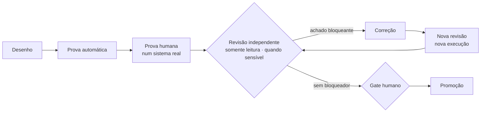

# Evidência de engenharia — como o CBini OrquestrAI entrega

🇧🇷 **Português** · 🇺🇸 [English](evidence.md) · 🇪🇸 [Español](evidence-es.md) · [README](../README-BR.md) · [Arquitetura](arch-br.md) · [Segurança](security-br.md)

Código que existe não é capacidade. Uma capacidade só é *Disponível* quando o caminho dela foi provado, e uma mudança sensível não é
promovida enquanto uma revisão independente ainda tem um achado bloqueante.

## O processo

- **Implementar e revisar são papéis separados.** Um agente de engenharia com IA implementa; outro revisa com acesso somente leitura e não
  pode alterar arquivos. Uma pessoa decide os gates.
- **A revisão tem resultado formal:** PASS, FAIL ou INCOMPLETE. Uma revisão interrompida ou ilegível nunca conta como aprovação, e cada
  nova rodada é uma revisão nova, registrada à parte, sobre um escopo congelado.
- **Os testes que guardam também são guardados.** As verificações que protegem a promoção são revisadas e endurecidas quando o revisor
  encontra um jeito de elas passarem em falso.

## Estudo de caso: o primeiro caminho full stack

1. O gerador de aplicações passou nos testes funcionais.
2. Uma revisão independente, somente leitura, encontrou casos de falha fora do caminho feliz. A promoção parou.
3. Os casos foram corrigidos; novas revisões rodaram até não restar achado bloqueante.
4. Uma pessoa executou um **aceite de 20 itens** numa instalação real — criar, persistir, evoluir, recusar mudança destrutiva, reverter,
   isolar, fazer backup e excluir — e registrou cada resultado.
5. Só então a capacidade passou de *em validação* para *Disponível*. O selo é derivado da prova registrada, não escrito à mão.

O mesmo aconteceu no fim: uma pequena mudança de interface foi reprovada pelo revisor (um caminho pelo teclado ainda disparava uma
exclusão), corrigida e aprovada na revisão seguinte.

## Matriz de evidência das capacidades

| Capacidade | Estado | Prova automática | Prova humana | Revisão independente | Limites conhecidos |
|---|---|---|---|---|---|
| Aprovação antes de executar | Disponível | ✓ | ✓ | ✓ | A aprovação é por BLOCO de comando |
| Execução isolada | Disponível | ✓ | ✓ | ✓ | Feita para os projetos do próprio operador, não para cargas não confiáveis |
| Reverter mudanças de arquivos | Disponível | ✓ | ✓ | ✓ | Só arquivos; dados de aplicação são protegidos pelo backup |
| Isolamento por projeto (chat, comandos, previews, custo) | Disponível | ✓ | ✓ | ✓ | Trabalho entre projetos não é uma operação única |
| Terminal do projeto somente leitura | Disponível | ✓ | ✓ | ✓ | Só inspeção |
| Telemetria de custo | Disponível | ✓ | ✓ | — | Preço desconhecido aparece como desconhecido |
| Lições governadas | Disponível | ✓ | ✓ | — | Só chegam aos agentes depois de aprovadas |
| Fábrica: sites estáticos | Disponível | ✓ | ✓ | — | Sites HTML, CSS e JavaScript |
| Fábrica: aplicações full stack | Disponível | ✓ | ✓ (20/20) | ✓ | Uma stack, um modelo de dados por app, evolução só aditiva |
| Backup cifrado fora do servidor | Disponível | ✓ | ✓ | ✓ | Restauração provada em isolamento |
| Recuperação completa num servidor novo | Planejado | — | — | — | Ainda não provada |

## O contrato de evolução do full stack

- **Uma stack validada:** React + Vite + TypeScript, Express e SQLite, gerada a partir de um modelo testado.
- **Evolução pelo chat:** o pedido vira um BLOCO revisável que diz o objetivo, o tipo de mudança, se os dados são preservados, mudanças
  destrutivas (nenhuma permitida), a mudança no banco e os arquivos afetados — antes do código, que continua disponível por inteiro.
- **Só aditiva:** campos novos são acrescentados; os registros existentes são preservados. Remover ou renomear campo é recusado.
- **Publicação automática depois da aprovação:** quando a pessoa aprova e a mudança é verificada, a aplicação é reconstruída e publicada;
  se a versão nova falhar, a anterior continua no ar. Uma aplicação parada pelo operador não é religada sozinha.
- **Revert:** restaura o código da aplicação e republica a versão anterior. Colunas já criadas no banco são mantidas, então nenhum dado é
  destruído por um revert.
