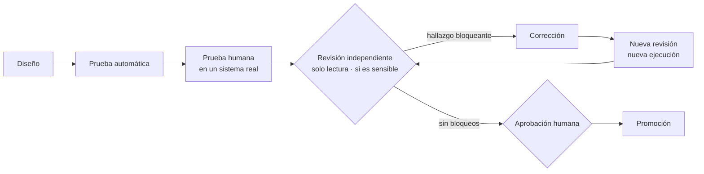

# Evidencia de ingeniería — cómo entrega CBini OrquestrAI

🇪🇸 **Español** · 🇧🇷 [Português](evidence-br.md) · 🇺🇸 [English](evidence.md) · [README](../README-ES.md) · [Arquitectura](arch-es.md) · [Seguridad](security-es.md)

El código que existe no es una capacidad. Una capacidad es *Disponible* solo cuando su camino fue demostrado, y un cambio sensible no se
promueve mientras una revisión independiente mantenga un hallazgo bloqueante.

## El proceso

- **Implementar y revisar son funciones separadas.** Un agente de ingeniería con IA implementa; otro revisa con acceso de solo lectura y no
  puede modificar archivos. Una persona decide las puertas de aprobación.
- **La revisión tiene un resultado formal:** PASS, FAIL o INCOMPLETE. Una revisión interrumpida o ilegible nunca cuenta como aprobada, y
  cada nueva ronda es una revisión nueva, registrada por separado, sobre un alcance congelado.
- **También se vigila a los vigilantes.** Las verificaciones que protegen la promoción se revisan y se refuerzan cuando el revisor encuentra
  una forma de que pasen en falso.

## Caso de estudio: el primer camino full stack

1. El generador de aplicaciones pasó sus pruebas funcionales.
2. Una revisión independiente, de solo lectura, encontró casos de falla fuera del camino feliz. La promoción se detuvo.
3. Los casos se corrigieron; se ejecutaron nuevas revisiones hasta que no quedó ningún hallazgo bloqueante.
4. Una persona realizó una **aceptación de 20 puntos** en una instalación real —crear, persistir, evolucionar, rechazar un cambio
   destructivo, revertir, aislar, respaldar y eliminar— y registró cada resultado.
5. Solo entonces la capacidad pasó de *en validación* a *Disponible*. La etiqueta se deriva de la prueba registrada, no se escribe a mano.

Lo mismo ocurrió al final: un pequeño cambio de interfaz fue rechazado por el revisor (un camino por teclado aún podía disparar una
eliminación), se corrigió y se aprobó en la revisión siguiente.

## Matriz de evidencia de capacidades

| Capacidad | Estado | Prueba automática | Prueba humana | Revisión independiente | Límites conocidos |
|---|---|---|---|---|---|
| Aprobación antes de ejecutar | Disponible | ✓ | ✓ | ✓ | La aprobación es por bloque de comando |
| Ejecución aislada | Disponible | ✓ | ✓ | ✓ | Pensada para los proyectos del propio operador, no para cargas no confiables |
| Revertir cambios de archivos | Disponible | ✓ | ✓ | ✓ | Solo archivos; los datos de aplicación los protege el respaldo |
| Aislamiento por proyecto (chat, comandos, vistas previas, costo) | Disponible | ✓ | ✓ | ✓ | El trabajo entre proyectos no es una sola operación |
| Terminal de proyecto de solo lectura | Disponible | ✓ | ✓ | ✓ | Solo inspección |
| Telemetría de costos | Disponible | ✓ | ✓ | — | Un precio desconocido se muestra como desconocido |
| Lecciones gobernadas | Disponible | ✓ | ✓ | — | Llegan a los agentes solo después de aprobadas |
| Fábrica: sitios estáticos | Disponible | ✓ | ✓ | — | Sitios HTML, CSS y JavaScript |
| Fábrica: aplicaciones full stack | Disponible | ✓ | ✓ (20/20) | ✓ | Un stack, un modelo de datos por aplicación, evolución solo aditiva |
| Respaldo cifrado fuera del servidor | Disponible | ✓ | ✓ | ✓ | Restauración demostrada en aislamiento |
| Recuperación completa en un servidor nuevo | Planificado | — | — | — | Aún no demostrada |

## El contrato de evolución full stack

- **Un stack validado:** React + Vite + TypeScript, Express y SQLite, generado a partir de una plantilla probada.
- **Evolución por el chat:** la solicitud se convierte en un bloque revisable que indica el objetivo, el tipo de cambio, si los datos se
  preservan, los cambios destructivos (ninguno permitido), el cambio en la base de datos y los archivos afectados, antes del código, que
  sigue disponible completo.
- **Solo aditiva:** se agregan campos nuevos; los registros existentes se preservan. Eliminar o renombrar un campo se rechaza.
- **Publicación automática tras la aprobación:** cuando la persona aprueba y el cambio se verifica, la aplicación se reconstruye y se
  publica; si la nueva versión falla, la anterior sigue en línea. Una aplicación detenida por el operador no se reinicia sola.
- **Revertir:** restaura el código de la aplicación y vuelve a publicar la versión anterior. Las columnas ya creadas en la base de datos se
  mantienen, por lo que ningún dato se destruye al revertir.
