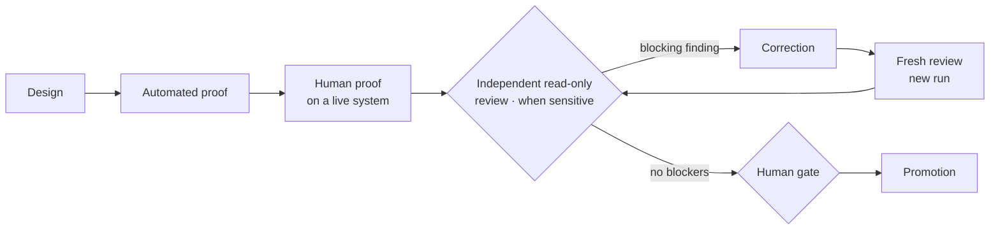

# Engineering evidence — how CBini OrquestrAI ships

🇺🇸 **English** · 🇧🇷 [Português](evidence-br.md) · 🇪🇸 [Español](evidence-es.md) · [README](../README.md) · [Architecture](arch.md) · [Security](security.md)

Code that exists is not a capability. A capability is *Available* only when its path has been proven, and a sensitive change cannot be
promoted while an independent review still holds a blocking finding.

## The process

- **Implementation and review are separate roles.** One AI engineering agent implements; a different one reviews with read-only access and
  cannot change files. A person decides the gates.
- **A review has a formal outcome:** PASS, FAIL or INCOMPLETE. An interrupted or unreadable review is never counted as a pass, and every
  rerun is a new, separately recorded review over a frozen scope.
- **Tests guard the guards.** The checks that protect promotion are themselves reviewed and hardened when the reviewer finds a way they
  could pass falsely.

## Case study: the first full-stack path

1. The application generator passed its functional tests.
2. An independent read-only review found failure cases outside the happy path. Promotion stopped.
3. The cases were corrected; fresh reviews ran until no blocking finding remained.
4. A person ran a **20-item acceptance** on a live deployment — create, persist, evolve, refuse a destructive change, revert, isolate,
   back up and delete — and recorded each result.
5. Only then did the capability change from *in validation* to *Available*. The label is derived from the recorded proof, not written by hand.

The same happened again at the end: a small interface change was rejected by the reviewer (a keyboard path could still trigger a
deletion), fixed, and approved on the next review.

## Capability evidence matrix

| Capability | Status | Automated proof | Human proof | Independent review | Known limits |
|---|---|---|---|---|---|
| Approval before execution | Available | ✓ | ✓ | ✓ | Approval is per command block |
| Isolated execution | Available | ✓ | ✓ | ✓ | Built for the operator's own projects, not untrusted workloads |
| Revert of file changes | Available | ✓ | ✓ | ✓ | Files only; application data is protected by backup |
| Project isolation (chat, commands, previews, cost) | Available | ✓ | ✓ | ✓ | Cross-project work is not a single operation |
| Read-only project terminal | Available | ✓ | ✓ | ✓ | Inspection only |
| Cost telemetry | Available | ✓ | ✓ | — | Unknown prices are shown as unknown |
| Governed lessons | Available | ✓ | ✓ | — | Reach agents only after approval |
| Factory: static websites | Available | ✓ | ✓ | — | HTML, CSS and JavaScript sites |
| Factory: full-stack applications | Available | ✓ | ✓ (20/20) | ✓ | One stack, one data model per app, additive evolution only |
| Encrypted off-site backup | Available | ✓ | ✓ | ✓ | Restore proven in isolation |
| Full recovery on a clean server | Planned | — | — | — | Not yet proven |

## The full-stack evolution contract

- **One validated stack:** React + Vite + TypeScript, Express and SQLite, generated from a tested template.
- **Evolution through the chat:** a request becomes a reviewable block that states the goal, the change type, whether data is preserved,
  destructive changes (none allowed), the database change and the files affected — before the code, which stays available in full.
- **Additive only:** new fields are added; existing records are preserved. Removing or renaming a field is refused.
- **Automatic publication after approval:** once the person approves and the change is verified, the application is rebuilt and published;
  if the new version fails, the previous one stays online. An application stopped by the operator is not restarted automatically.
- **Revert:** restores the application's code and republishes the previous version. Database columns already created are kept, so no
  data is destroyed by a revert.
