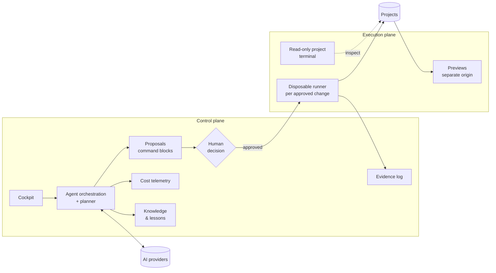
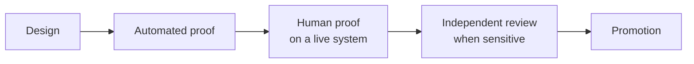

# Technical overview — CBini OrquestrAI

🇺🇸 **English** · 🇧🇷 [Português](technical-overview.pt-BR.md) · [README](../README.md) · [Security model](security-model.md)

This page explains how OrquestrAI is organized and where its boundaries are. It describes the product's architecture, not its
implementation; the source code is private.

## The thesis

AI agents are engines. OrquestrAI is the engineering layer that decides how their work becomes real.

It does not compete with the models or coding agents it uses. It organizes their work, puts a human decision at the point where a change
becomes real, isolates execution, measures cost and keeps the evidence. Models and providers can change underneath without the
governance layer changing with them. This is the product's architectural bet; it is not presented here as a proven market advantage.

## Two planes

- **Control plane** — where people and agents work: conversations, plans, proposals, approvals, cost, knowledge, evidence.
  It never executes AI output by itself.
- **Execution plane** — where changes happen: short-lived, constrained environments that see one project at a time.

## The life of a change

| Step | What happens | Boundary |
|---|---|---|
| 1. Intent | The operator describes a change in the project's chat. | Every conversation belongs to exactly one project. |
| 2. Planning | A planner chooses which specialized agents run; each output and its cost are recorded. | Agents produce text, never side effects. |
| 3. Proposal | Anything that would change a system becomes a command block with a declared intent. | The chat cannot execute. |
| 4. Understanding | On request, the block is explained in plain language: intent, steps, impact, risk. | Explaining runs nothing. |
| 5. Decision | The operator approves, or vetoes with a reason that is fed back into the next plan. | A vetoed version can never run. |
| 6. Pre-check | The system reads what the block may touch and refuses what it cannot analyze safely. | Unclear scope = refusal, not a guess. |
| 7. Execution | The block runs in a disposable environment: no network, read-only system, no privileges, only that project mounted. | One project per execution. |
| 8. Evidence | The result, the measured effect and a chained record are stored; changed pages get a preview link. | Records are tamper-evident. |
| 9. Revert | The undo plan is shown before anything is reverted; the revert is itself recorded and can be redone. | Files only; app data is out of scope by design. |

## Projects as the unit of isolation

A project is the boundary for conversation history, command execution, terminal sessions, previews and cost attribution. Changing the
active project changes all of them together. The operator's terminal into a project is read-only and network-less; changes go through
approved command blocks. Administrative access to the host is a separate surface that requires a second factor on every session.

## Agents and the planner

Work is done by specialized agents — strategy, exploration, architecture, code, review, testing, documentation, metrics. A planner
decides which ones a task needs; agents not called are shown as skipped and cost nothing. Each agent is routed to a model independently.

## Providers

Routing is per agent. The validated routes use Anthropic and OpenAI models. Other providers (Groq, Gemini, OpenRouter, Cerebras, Z.ai and
any OpenAI-compatible API) can be configured and tested from the panel. Provider keys are encrypted at rest and never sent back to the
browser.

## Cost

Every model call is recorded with project, agent, surface, tokens and latency. Prices are applied only from known price data; a call
without a known price is shown as *unknown*, never as zero. Cost is visible per project, per agent and per call.

## Knowledge

After work, the system may propose a lesson. A lesson enters a review queue and, in governed mode, reaches agents only after a person
approves and activates it. The interface separates the AI's suggestion from the operator's decision.

## The project factory

A short brief becomes a project: agents plan it, a generator builds it, automated checks reject output that would not work in the sandboxed
preview, and the result opens on a separate origin. Static sites work end to end. The first full-stack path — React + Vite + TypeScript,
Express and SQLite in one process — is in validation: the AI writes a validated application specification and the application is generated
from a tested template, so infrastructure is identical across projects. Running each application in its own isolated runtime is the work in progress.

## Recovery

Code is versioned. Operational state is replicated continuously and packaged daily into an encrypted off-site backup; an automatic verifier
checks each package for completeness and for secrets in clear text. Restore has been proven in an isolated environment; full recovery on a
clean server is planned and not yet proven.

## Engineering evidence

A capability is not counted because the code exists. It is counted when the path has been proven:

Sensitive changes — execution, isolation, recovery — are reviewed read-only by an independent auditor before promotion. A failed review
stops the promotion, even when every functional test passes. The first full-stack generator is an example: it passed its tests, the review
found failure cases outside the happy path, and it was held back until they are fixed.
