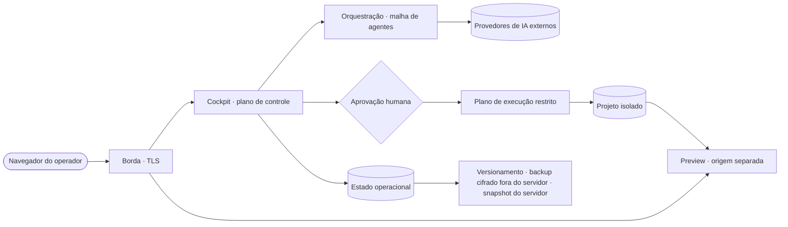
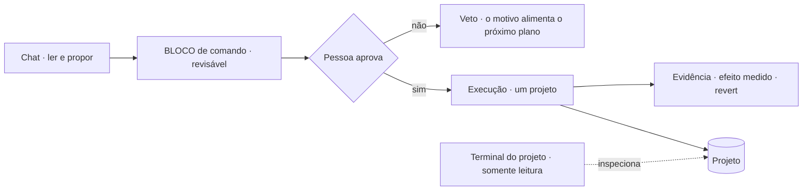

# Implantação e fronteiras de confiança — CBini OrquestrAI

🇧🇷 **Português** · 🇺🇸 [English](trust.md) · 🇪🇸 [Español](trust-es.md) · [README](../README-BR.md) · [Arquitetura](arch-br.md) · [Segurança](security-br.md)

Onde cada coisa roda, o que pertence a quem, o que sai da instalação e onde uma mudança vira real. Conceitual por desenho: nomes de
servidores, portas, caminhos e configuração operacional ficam de fora de propósito.

## Modelo de implantação

- **Uma organização por instalação**, num servidor dedicado que ela controla. Hospedagem multi-tenant não é objetivo da versão atual.
- **Seus provedores, suas chaves.** As contas de provedores de IA pertencem à instalação; as chaves ficam cifradas em repouso e nunca
  voltam para o navegador.
- **Governança e rastreabilidade em primeiro lugar.** A instalação é o registro oficial de projetos, aprovações, execuções e custos.

Isto descreve a arquitetura atual, não uma oferta comercial.

## Infraestrutura, num relance

| Camada | Tecnologia (alto nível) |
|---|---|
| Plano de controle | Serviço Node.js com cockpit web |
| Estado operacional | Bancos SQL embarcados, replicados continuamente |
| Plano de execução | Containers de vida curta: sem rede, sistema somente leitura, sem privilégios, um projeto montado |
| Aplicações geradas | Front-end React + Vite + TypeScript, API Express, SQLite, cada uma no próprio ambiente sem rede |
| Borda | Proxy reverso com TLS; previews servidos em origem separada |
| Recuperação | Controle de versão, backup cifrado fora do servidor com verificação automática, snapshots do servidor |

## Fronteiras de confiança

| Zona | O que vive ali | Quem decide |
|---|---|---|
| **Instalação** | Cockpit, projetos, conversas, aprovações, registros de execução, custos, lições, backups | A organização que a opera |
| **Projeto** | Seus arquivos, histórico de conversa, lições aprovadas, execuções, previews e dados da aplicação | Os operadores daquele projeto; outros projetos não o enxergam |
| **Plano de controle** | Planejamento, propostas, explicações, custos, evidência | Agentes só produzem texto; nada aqui altera um projeto sozinho |
| **Plano de execução** | A execução de um comando aprovado, sobre um projeto | Só depois que uma pessoa aprova o comando |
| **Origem de preview** | Sites e aplicações gerados | Servida à parte do cockpit; nunca enxerga a sessão do operador |
| **Provedor de IA externo** | O conteúdo enviado em cada chamada de modelo | Os termos daquele provedor |

## Fluxo de dados — o que sai da instalação

Quando um provedor de IA na nuvem é usado, o conteúdo necessário para cada chamada — o pedido, o contexto relevante do projeto e trechos de
código — é enviado a esse provedor. O OrquestrAI não esconde nem impede isso; ele torna explícito: você escolhe quais provedores ficam
configurados, cada chamada é registrada com projeto, agente e modelo, e o custo é atribuído. **Self-hosted não significa que nenhum dado
sai do servidor.** Significa que a infraestrutura, os registros e a escolha dos provedores ficam sob o seu controle.

## Onde uma mudança vira real

- **Superfícies somente leitura:** o chat, as explicações, o terminal do projeto e os previews não alteram um projeto.
- **O único ponto de mudança:** um BLOCO aprovado, executado no plano restrito, registrado e — onde suportado — reversível.
- **A saída da Fábrica** (páginas e aplicações geradas) é escrita por geradores validados, não executando comandos escritos pela IA;
  uma aplicação full stack só é publicada a partir do conteúdo que foi autorizado.
