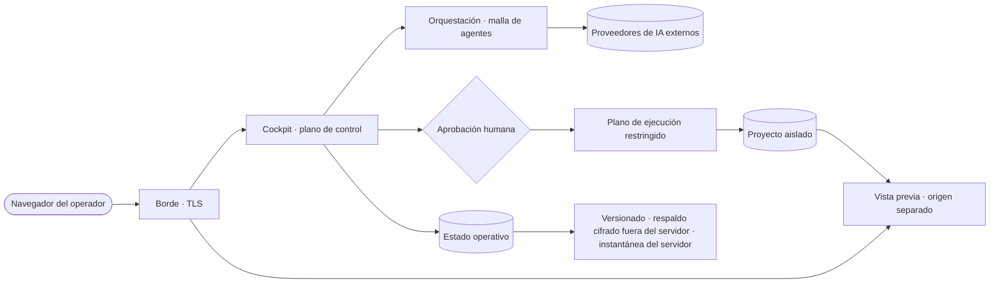
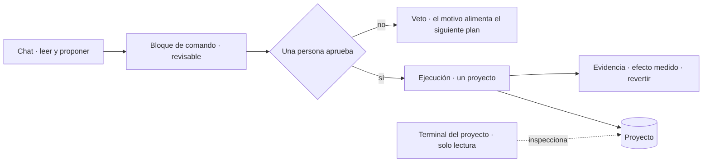

# Despliegue y fronteras de confianza — CBini OrquestrAI

🇪🇸 **Español** · 🇧🇷 [Português](trust-br.md) · 🇺🇸 [English](trust.md) · [README](../README-ES.md) · [Arquitectura](arch-es.md) · [Seguridad](security-es.md)

Dónde se ejecuta cada cosa, qué pertenece a quién, qué sale de la instalación y dónde un cambio se vuelve real. Conceptual por diseño:
nombres de servidores, puertos, rutas y configuración operativa se omiten a propósito.

## Modelo de despliegue

- **Una organización por instalación**, en un servidor dedicado que ella controla. El hosting multiinquilino no es objetivo de la versión actual.
- **Sus proveedores, sus claves.** Las cuentas de proveedores de IA pertenecen a la instalación; las claves se guardan cifradas y nunca
  vuelven al navegador.
- **Gobernanza y trazabilidad primero.** La instalación es el registro oficial de proyectos, aprobaciones, ejecuciones y costos.

Esto describe la arquitectura actual, no una oferta comercial.

## Infraestructura, de un vistazo

| Capa | Tecnología (alto nivel) |
|---|---|
| Plano de control | Servicio Node.js con cockpit web |
| Estado operativo | Bases de datos SQL embebidas, replicadas de forma continua |
| Plano de ejecución | Contenedores de vida corta: sin red, sistema de solo lectura, sin privilegios, un proyecto montado |
| Aplicaciones generadas | Front-end React + Vite + TypeScript, API Express, SQLite, cada una en su propio entorno sin red |
| Borde | Proxy inverso con TLS; vistas previas servidas en un origen separado |
| Recuperación | Control de versiones, respaldo cifrado fuera del servidor con verificación automática, instantáneas del servidor |

## Fronteras de confianza

| Zona | Qué vive allí | Quién decide |
|---|---|---|
| **Instalación** | Cockpit, proyectos, conversaciones, aprobaciones, registros de ejecución, costos, lecciones, respaldos | La organización que la opera |
| **Proyecto** | Sus archivos, historial de conversación, lecciones aprobadas, ejecuciones, vistas previas y datos de la aplicación | Los operadores de ese proyecto; otros proyectos no lo ven |
| **Plano de control** | Planificación, propuestas, explicaciones, costos, evidencia | Los agentes solo producen texto; nada aquí cambia un proyecto por sí solo |
| **Plano de ejecución** | La ejecución de un comando aprobado, sobre un proyecto | Solo después de que una persona aprueba el comando |
| **Origen de vista previa** | Sitios y aplicaciones generados | Servido aparte del cockpit; nunca ve la sesión del operador |
| **Proveedor de IA externo** | El contenido enviado en cada llamada al modelo | Los términos de ese proveedor |

## Flujo de datos: qué sale de la instalación

Cuando se usa un proveedor de IA en la nube, el contenido necesario para cada llamada —la solicitud, el contexto relevante del proyecto y
fragmentos de código— se envía a ese proveedor. OrquestrAI no lo oculta ni lo impide; lo hace explícito: usted elige qué proveedores se
configuran, cada llamada queda registrada con proyecto, agente y modelo, y el costo se atribuye. **Autoalojado no significa que ningún dato
salga del servidor.** Significa que la infraestructura, los registros y la elección de proveedores quedan bajo su control.

## Dónde un cambio se vuelve real

- **Superficies de solo lectura:** el chat, las explicaciones, la terminal del proyecto y las vistas previas no cambian un proyecto.
- **El único punto de cambio:** un bloque de comando aprobado, ejecutado en el plano restringido, registrado y, donde está soportado, reversible.
- **La salida de la Fábrica** (páginas y aplicaciones generadas) la escriben generadores validados, no la ejecución de comandos escritos por
  la IA; una aplicación full stack solo se publica a partir del contenido que fue autorizado.
