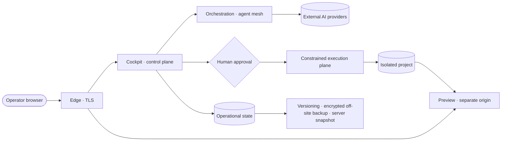
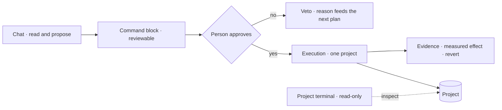

# Deployment and trust boundaries — CBini OrquestrAI

🇺🇸 **English** · 🇧🇷 [Português](trust-br.md) · 🇪🇸 [Español](trust-es.md) · [README](../README.md) · [Architecture](arch.md) · [Security](security.md)

Where things run, what belongs to whom, what leaves the installation, and where a change becomes real. Conceptual by design: hostnames,
ports, paths and operational configuration are intentionally omitted.

## Deployment model

- **One organization per installation**, on a dedicated server the organization controls. Multi-tenant hosting is not a goal of the
  current version.
- **Your providers, your keys.** AI provider accounts belong to the installation; keys are encrypted at rest and never returned to the browser.
- **Governance and traceability first.** The installation is the system of record for projects, approvals, executions and costs.

This describes the current architecture, not a commercial offer.

## Infrastructure, at a glance

| Layer | Technology (high level) |
|---|---|
| Control plane | Node.js service with a web cockpit |
| Operational state | Embedded SQL databases, continuously replicated |
| Execution plane | Short-lived containers: no network, read-only system, no privileges, one project mounted |
| Generated applications | React + Vite + TypeScript front end, Express API, SQLite, each in its own network-less runtime |
| Edge | Reverse proxy with TLS; previews served on a separate origin |
| Recovery | Version control, encrypted off-site backup verified automatically, server snapshots |

## Trust boundaries

| Zone | What lives there | Who decides |
|---|---|---|
| **Installation** | Cockpit, projects, conversations, approvals, execution records, costs, lessons, backups | The organization that operates it |
| **Project** | Its files, conversation history, approved lessons, executions, previews and application data | Operators working in that project; other projects cannot see it |
| **Control plane** | Planning, proposals, explanations, cost accounting, evidence | Agents produce text only; nothing here changes a project by itself |
| **Execution plane** | The run of one approved command, against one project | Only after a person approves the command |
| **Preview origin** | Generated sites and applications | Served apart from the cockpit; it never sees the operator's session |
| **External AI provider** | The content sent with each model call | That provider's own terms |

## Data flow — what leaves the installation

When a cloud AI provider is used, the content needed for each call — the prompt, relevant project context and code excerpts — is sent to
that provider. OrquestrAI does not hide or prevent this; it makes it explicit: you choose which providers are configured, each call is
recorded with its project, agent and model, and the cost is attributed. **Self-hosted does not mean that no data ever leaves the server.**
It means the infrastructure, the records and the choice of providers stay under your control.

## Where a change becomes real

- **Read-only surfaces:** the chat, explanations, the project terminal and previews cannot change a project.
- **The single point of change:** an approved command block, executed in the constrained plane, recorded and — where supported — reversible.
- **Factory output** (generated pages and applications) is written by validated generators, not by running AI-written commands; a
  full-stack application is published only from the content that was authorized.
